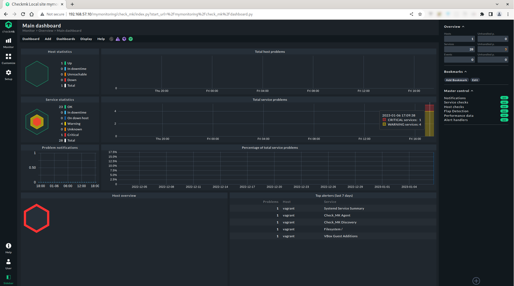

# Checkmk

Installing and monitoring with Checkmk free edition

## Motivation

I recently discovered [checkmk](https://checkmk.com) by two cool Computer Scientists with excellent and broad knowledge. I usually use [Zabbix](https://www.zabbix.com), [Icinga](https://icinga.com), [Nagios](https://www.nagios.org) etc, which I have worked on in the past, BTW are really great tools and I still use some of them today. So, since I saw [checkmk](https://checkmk.com) I can't take my eyes off it, I want to be all around it and get in depth with this amazing open source monitoring tool (give them a :star: on [GitHub](https://github.com/tribe29/checkmk/)). Let's have some fun and break the installation process into detailed pieces!



## VM installation

Follow the [Vagrant](https://github.com/ncklinux/vagrant-ubuntu64) project of mine to spin up a new Ubuntu VM or use a ready-made [Vagrant Box](https://app.vagrantup.com/boxes/search) for convenience. Alternatively, you can use [Docker](https://github.com/ncklinux/docker-lemp) if you prefer (which I use daily). Also, you can choose [VirtualBox](https://www.virtualbox.org/wiki/Downloads) (Vagrant actually does) and install [Ubuntu](https://ubuntu.com/download/server), [Debian](https://www.debian.org/download), [SLES](https://www.suse.com/products/server/) or [RedHat/CentOS](https://www.centos.org) or just any free/paid VM hosting, that actually can give you a virtual machine with those distributions, and of course with command line access.

## Ubuntu CLI

So, suppose you choose Vagrant, then [download](https://checkmk.com/download) and install checkmk (there's also an [official installation guide](https://docs.checkmk.com/latest/en/install_packages_debian.html)).

```bash
# Spin your VM
$ git clone git@github.com:ncklinux/Checkmk.git
$ cd Checkmk

# Manage multiple VMs
$ vagrant up
$ vagrant global-status
# id       name    provider   state    directory
# -------------------------------------------------------------------
# mpc777i  master  virtualbox running  /home/YOUR_USER/Checkmk
# mpc778i  node    virtualbox running  /home/YOUR_USER/Checkmk

# The above shows information about all known Vagrant environments
# on this machine. This data is cached and may not be completely
# up-to-date (use "vagrant global-status --prune" to prune invalid
# entries). To interact with any of the machines, you can go to that
# directory and run Vagrant, or you can use the ID directly with
# Vagrant commands from any directory. For example:
# "vagrant destroy mpc777i"

# SSH to the master VM (by using the name)
$ vagrant ssh master # or vagrant ssh node

# If for any reason you need to shutdown use: vagrant halt master
# or without name for all VMs: vagrant halt

# Find out which release of Ubuntu you are using to download the correct free version of checkmk for your system https://checkmk.com/download
$ sudo lsb_release -a

# Retrieve the package
$ cd /tmp
$ wget https://download.checkmk.com/checkmk/2.1.0p18/check-mk-free-2.1.0p18_0.jammy_amd64.deb # Again, use your version here from https://checkmk.com/download

# Disk space check (will take 1.5GB more or less)
$ df -h

# Install the package and it's dependencies, the version in my case is as follows:
$ sudo apt install ./check-mk-free-2.1.0p18_0.jammy_amd64.deb -y

# OMD ;) The Open Monitoring Distribution https://docs.checkmk.com/latest/en/omd_basics.html
$ omd version # Should print out something like "OMD - Open Monitoring Distribution Version 2.1.0p18.cfe" with the actual version (2.1.0p18) I've used in this case

# Let's see first what it did on our system
$ sudo systemctl list-units | grep "check\|omd" # One service at the moment
# check-mk-free-2.1.0p18.service   loaded active exited   LSB: OMD sites
$ sudo netstat -tupln # Nothing yet
$ which omd # The binary
$ ls -ls / # A symlink
# lrwxrwxrwx 1 root root 8 Jan 4 19:58 omd -> /opt/omd
$ ls -ls /opt/omd/ # Here are Apache, sites (instances I guess) and versions

#Let's create our first monitoring site now, the instance (and you can have of multiple of them)
$ omd create mymonitoring # You can replace mymonitoring your own name and should print something like the following:
# Adding /opt/omd/sites/mymonitoring/tmp to /etc/fstab.
# Creating temporary filesystem /omd/sites/mymonitoring/tmp...OK
# Updating core configuration...
# Generating configuration for core (type cmc)...
#
# WARNING: The number of configured checkers is higher than the number of available CPUs. To avoid unnecessary context switches, the number of checkers should be limited to the number of CPUs. Recommended number of checkers: 1
# Starting full compilation for all hosts Creating global helper config...OK
#  Creating cmc protobuf configuration...OK
# Executing post-create script "01_create-sample-config.py"...OK
# Created new site mymonitoring with version 2.1.0p18.cfe.
#
#   The site can be started with omd start mymonitoring.
#   The default web UI is available at http://vagrant/mymonitoring/
#
#   The admin user for the web applications is cmkadmin with password: YOUR_PASSWORD_WILL_APPEAR_HERE
#   For command line administration of the site, log in with 'omd su mymonitoring'.
#   After logging in, you can change the password for cmkadmin with 'cmk-passwd cmkadmin'.

$ sudo systemctl list-units | grep "check\|omd" # Two running services
# opt-omd-sites-mymonitoring-tmp.mount   loaded active mounted   /opt/omd/sites/mymonitoring/tmp
# check-mk-free-2.1.0p18.service         loaded active exited    LSB: OMD sites

$ omd start mymonitoring # It will produce the following output:
# Temporary filesystem already mounted
# Starting agent-receiver...OK
# Starting mkeventd...OK
# Starting liveproxyd...OK
# Starting mknotifyd...OK
# Starting rrdcached...OK
# Starting cmc...OK
# Starting apache...OK
# Starting dcd...OK
# Starting redis...OK
# Initializing Crontab...OK

# List all available commands
$ omd

# Check status
$ omd status mymonitoring
# agent-receiver: running
# mkeventd:       running
# liveproxyd:     running
# mknotifyd:      running
# rrdcached:      running
# cmc:            running
# apache:         running
# dcd:            running
# redis:          running
# crontab:        running
# -----------------------
# Overall state:  running

# List all sites
$ omd sites
# SITE             VERSION          COMMENTS
# mymonitoring     2.1.0p18.cfe     default version

# Man page ;)
man omd
# OMD(8) System Manager's Manual OMD(8)
#
# NAME
#       omd - admin interface for OMD, the Open Monitoring Distribution
#
# SYNOPSIS
#        omd [command [site...]  ]
#
# DESCRIPTION
#        OMD  -  the Open Monitoring Distribution is something really new. OMD bundles existing open source software to ease the installation procedure of Nagios and many important addons like NagVis, PNP4Nagios, rrdtool, nagios-plug‐
#        ins, Check_MK, MK Livestatus, Dokuwiki, NSCA, check_nrpe and others.
#
#        OMD supports:
#
#        - multiple versions of OMD installed in parallel
#        - multiple instances of Nagios running in parallel (so called "sites")
#
#        omd is the administration interface for creating and maintaining sites within OMD - the open monitoring distribution.
#
# COMMANDS
#        omd help
#               Show short summary of available commands.
# ...
```

Make sure that IPs do not collide with other machines on the same network, use [nmap](https://wiki.archlinux.org/title/nmap) or [Angry IP Scanner](https://angryip.org) for that.

On reboot `omd` will start automatically but it's always good to check the status `omd status mymonitoring`.

In the meantime it's nice to know more about checkmk's [ports](https://docs.checkmk.com/latest/en/ports.html).

Visit the monitoring UI at [http://192.168.57.10/mymonitoring/](http://192.168.57.10/mymonitoring/) and login (the default username is `cmkadmin` and the password is in the `omd create mymonitoring` output of the example above).


## checkmk UI

The first thing to do is to monitor the master VM itself, navigate to "Setup->Agents(Windows, Linux, Solaris, AIX)" and select/download the Ubuntu agent `check-mk-agent_2.1.0p18-2ec94b9ec2f2a91a_all.deb` (your file may differ in the version), then copy the agent to the VM:

```bash
# Install vagrant-scp plugin
$ vagrant plugin install vagrant-scp

# Copy the downloaded agent
$ vagrant scp /home/YOUR_USER/Downloads/check-mk-agent_2.1.0p18-2ec94b9ec2f2a91a_all.deb master:/tmp

$ vagrant ssh master
$ cd /tmp
$ sudo apt install ./check-mk-agent_2.1.0p18-2ec94b9ec2f2a91a_all.deb
$ sudo systemctl list-units | grep "check\|omd"
# opt-omd-sites-mymonitoring-tmp.mount   loaded active mounted   /opt/omd/sites/mymonitoring/tmp
# check-mk-agent-async.service           loaded active running   Checkmk agent - Asynchronous background tasks
# check-mk-free-2.1.0p18.service         loaded active exited    LSB: OMD sites
# omd.service                            loaded active exited    Checkmk Monitoring
# check-mk-agent.socket                  loaded active listening Local Checkmk agent socket
```

In order to add the VM to the monitoring system do the following:

1. Click on "Setup->Hosts->Add Host" and add the hostname `master` (to find the FQDN use `hostname -f`)
2. Add the IP address `192.168.57.10` (the IP can be optional if you used your real unique FQDN)
3. Click on "Save & go to service configuration" and you should start receiving all discovered services
4. Use the + or - buttons to choose which ones to monitor or click "Accept all"
5. At the top right you can see your "changes", which you have to apply manually, click on "Activate on selected sites"

That's all, then you can check everything from the "Overview" panel, click on the "Hosts" (on number 1) and a table with the status of the VM will appear.

For additional VMs (e.g. node), copy and install the agent `vagrant scp /home/YOUR_USER/Downloads/check-mk-agent_2.1.0p18-2ec94b9ec2f2a91a_all.deb node:/tmp`. On the master VM (with checkmk installed), repeat the same steps from 1-5, simply add through the UI the new host.


## Update checkmk

Downloading and installing the [newest](https://checkmk.com/product/latest-version) version of checkmk does not mean that your site is using the latest version (not if you restart the services and not even after reboot), this happens for an important reason, it allows you to use multiple versions running in [parallel](https://docs.checkmk.com/latest/en/update.html) :wink:

```bash
$ vagrant up master
$ vagrant ssh master
$ $ cd /tmp
$ wget https://download.checkmk.com/checkmk/2.1.0p18/check-mk-free-2.1.0p18_0.jammy_amd64.deb # Let's assume that this is the latest version
$ sudo apt install ./check-mk-free-2.1.0p18_0.jammy_amd64.deb -y
$ omd version # Show version
$ omd versions # Show all versions (the character p in the version stands for patch)
$ omd sites # To see which version each site is using
$ omd status mymonitoring
$ omd stop mymonitoring
$ omd update mymonitoring
$ omd start mymonitoring
```

Run multiple versions in parallel! This is actually very useful if you want to run tests without affecting the monitoring UI currently used by other people, e.g. to test the latest version or other sites etc. What's the beauty? You don't need a new VM to do it :relieved:

```bash
$ omd create anothermonitoring
$ omd su anothermonitoring
$ htpasswd etc/htpasswd cmkadmin # change the password
$ omd start anothermonitoring
```

Visit the new monitoring UI at [http://192.168.57.10/anothermonitoring/](http://192.168.57.10/anothermonitoring/)

## Plugins

Checkmk offers many ready-made plugins (2000 more or less) for most hardware and software. You can find them on [Checkmk Exchange](https://exchange.checkmk.com/), where there are even more plugins contributed by users. I've made an example of an object-oriented plugin in Python, which can be found in the [plugins directory](https://github.com/ncklinux/Checkmk/tree/main/plugins) of this project.

```bash
$ git clone git@github.com:ncklinux/Checkmk.git
$ cd Checkmk
$ vagrant up master
$ vagrant scp plugins/ping.py master:/usr/lib/check_mk_agent/plugins
$ vagrant ssh master
$ chmod +x /usr/lib/check_mk_agent/plugins/ping.py
$ sudo omd su mymonitoring
$ cd /usr/lib/check_mk_agent/plugins/ && ls -la
$ ./ping.py
# OMD[mymonitoring]:/usr/lib/check_mk_agent/plugins$ ./ping.py
# <<<ping>>>
# 127.0.0.1 = up!
# 10.0.4.14 = up!
# 192.168.57.10 = up!
# ::1 = up!
# dr88::e33:88uu:fg34:azb7%bfg3b3 = up!
# dr88::e33:88uu:ft50:mb77%bfg3b8 = up!
$ check_mk_agent | less # In order to locate the above result, type :/ping (just like in Vim) or use other CLI commands e.g. grep
```

The next step will be to [declare the section](https://docs.checkmk.com/latest/en/devel_check_plugins.html#_declaring_the_section) and for Checkmk to know that the new check exists, it must be [registered](https://docs.checkmk.com/latest/en/devel_check_plugins.html#_registering_the_check).

## License

MIT

## Disclaimer

This project is distributed FREE & WITHOUT ANY WARRANTY. Report any bugs or suggestions here as an [issue](https://github.com/ncklinux/Checkmk/issues/new).

## Contributing

Please read the [contribution](https://github.com/ncklinux/.github/blob/main/CONTRIBUTING.md) guidelines.

## Commit Messages

This repository follows the [Conventional Commits](https://www.conventionalcommits.org) specification, the commit message should never exceed 100 characters and must be structured as follows:

```
<type>[optional scope]: <description>

[optional body]

[optional footer(s)]
```

## Powered by


